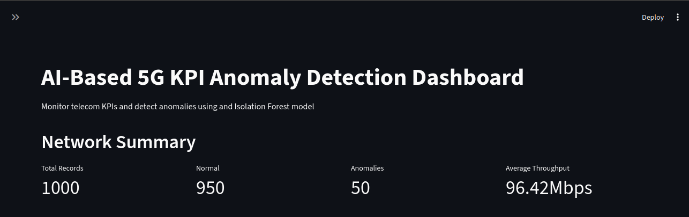
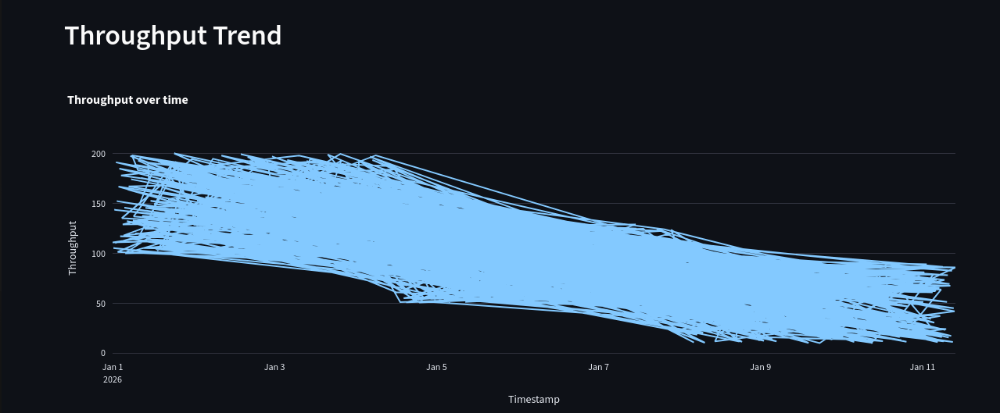
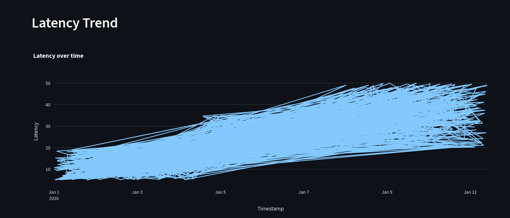
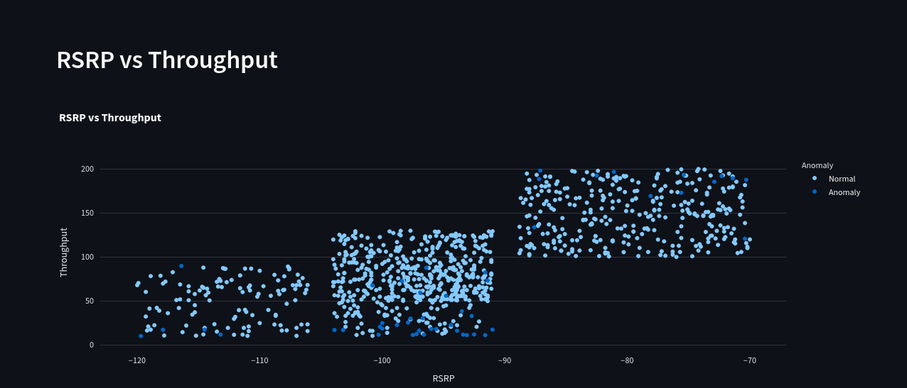

# AI-Based 5G Telecom KPI Anomaly Detection Dashboard
An AI-powered application that detects anomalies in telecom network Key Performance Indicators (KPIs) using the **Isolation Forest** machine learning algorithm. The project preprocesses telecom KPI data, engineers meaningful features, detects ab normal network behavior, and visualizes the results using and interactive Streamlit dashboard.
## Project Overview
Telecommunication networks generate large volumes of KPI data every day. Monitoring this data manually is difficult and time-consuming. This project automates the anomaly detection process by applying machine learning to identify unusual KPI patterns.
The application performs:
- Data preprocessing
- Feature engineering
- Feature scaling
- Isolation Forest anomaly detection
- Interactive dashboard visualization
- Result export
## Features
- Telecom KPI preprocessing
- Missing value handling
- Duplicate removal
- Feature engineering
- Signal Quality Score Calculation
- Network Load calculation
- Network Health Index Calculation
- StandardScaler normalization
- Isolation Forest anomaly detection
- Hyperparameter tuning
- Model evaluation
- Interactive Streamlit dashboard
- CSV export
## Technology Stack
|   Component   |   Technology   |
|---------------|----------------|
|Programming Language|Python 3.12|
|Data Processing|     Pandas     |
|Machine Learning|  Scikit-learn |
|Feature Scaling| StandardScaler |
|   Algorithm   |Isolation Forest|
| Visualization | Plotly Express |
|   Dashboard   |   Streamlit    |
| Model Storage |     Joblib     |
|Version Control|      Git       |
|  Repository   |     GitHub     |
## Project Structure
```
telecom-ai-capstone/
│
├── app/
│   └── streamlit_app.py
│
├── data/
│
├── docs/
│   ├── architecture.pdf
│   ├── api_documentation.pdf
│   ├── installation_guide.pdf
│   ├── evaluation_report.pdf
│   └── learning_log.pdf
│
├── models/
│
├── notebooks/
│
├── src/
│
├── screenshots/
│
├── presentation/
│   └── final_presentation.pptx
│
├── README.md
├── requirements.txt
├── LICENSE
└── .gitignore
```
## Installation
- Clone the repository
```bash
git clone https://github.com/vibhutichaddha/AI-based-telecom-network-solution.git
```
- Move into the project folder
```bash
cd KPI_anomaly_detection_dashboard
```
- Create a virtual environment
```bash
python3 -m venv venv
```
- Install dependencies
```bash
pip install -r requirements.txt
```
## Running the Project
#### Step 1 - Data Preprocessing
```bash
python src/preprocessing.py
```
#### Step 2 - Feature Engineering
```bash
python src/feature_engineering.py
```
#### Step 3 - Train Isolation Forest
```bash
python src/model.py
```
#### Step 4 - Evaluate model
```bash
python src/evaluation.py
```
#### Step 5 - Hyperparameter Tuning
```bash
python src/hyperparameter_tuning.py
```
#### Step 6 - Launch Dashboard
```bash
streamlit run app/streamlit_app.py
```
## Feature Engineering
Three additional features were created.
- Signal Quality Score
```
0.6 * SINR + 0.4 * (RSRP+120)
```
- Network Load
```
Connected Users/200
```
- Network Health Index
```
Throughput-Latency-(10*Packet Loss)
```
## Machine Learning Model
The project uses **Isolation Forest** for anomaly detection.
### Model Parameters
|  Parameters   |  Value  |
|---------------|---------|
|  Algorithm    |Isolation Forest|
|     Trees     |   100   |
| Contamination |   0.05  |
|  Random State |    42   |
## Dashboard Features
The Streamlit dashboard includes:
- KPI Summary Cards
- Cell ID Filter
- Throughput Trend
- Latency Trend
- SINR Distribution
- RSRP vs Throughput Scatter Plot
- Anomaly Distribution
- Download Results
## Screenshots
```
screenshots/
dashboard_home.png
throughput.png
latency.png
scatter_plot.png
anomaly_distribution.png
```
```markdown
### Dashboard



### Throughput



### Latency



### Scatter Plot


```
## Sample Output
Example prediction output.
|  Cell ID  |  Throughput  |  Latency  |  Prediction  |
|-----------|--------------|-----------|--------------|
|  Cell_001 |   95 Mbps    |   15 ms   |    Normal    |
|  Cell_045 |   18 Mbps    |   78 ms   |    Anomaly   |
|  Cell_087 |   22 Mbps    |   82 ms   |    Anomaly   |
## Output Files
```
models/
isolation_forest.pkl
scaler.pkl
```
```
reports/ 
model_evaluation.txt
hyperparameter_tuning.csv
```
```
data/processed/
telecom_kpi_cleaned.csv
telecom_kpi_processed.csv
telecom_kpi_with_anomalies.csv
```
## Future Improvements 
- Real-time KPI monitoring
- Cloud deployment
- Automatic alert notifications
- Root Cause Analysis
- Database integration
- Authentication
- Compare with Autoencoders
- Compare with One-Class SVM
## Author
*Vibhuti Chaddha*
